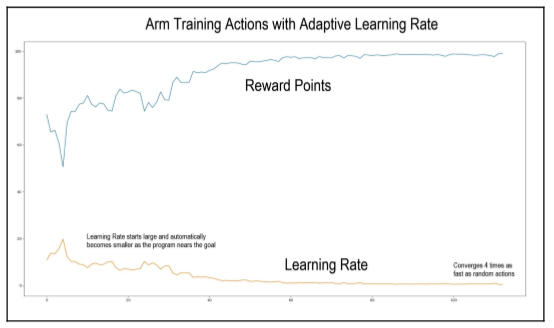

# 5.2 Анализ задачи

Теперь мы прыгнем в глубь и начинаем писать код.

Мы можем начать с разговора о том, как мы посылаем команды в манипулятор/клешню. Двигатели, которые я выбрал для робота TinMan, являются более мощными версиями стандартных "servo motors"- серводвигателей, с металлическими зубчатыми колесами. "Servo motors"- Серводвигатели управляются путем установки угла, под которым будет предполагаться выходной “shaft to assume”. Углы ведут в диапазоне от 0 до 180 градусов. Однако команды для позиций двигателя выполняются от 1 до 255, поэтому они помещаются в одно 8-битное значение. Мы будем преобразовывать эти байтовые команды двигателя в и из углов в программе.

## 5.3.1 Первая версия - состояние действия RL

В нашей первой версии программы обучения работе с манипулятором/клешней мы познакомим вас с базовой основой и используем самую примитивную форму машинного обучения, которая заключается в том, чтобы просто попробовать случайные движения, пока программа не найдет что-то, что работает.


Вы должны иметь в виду, что определенное положение манипулятора/клешни может иметь несколько действительных решений в нашей комбинации из трех двигателей.  Например, двигатель 1 может иметь чуть больший угол, а двигатель 3 чуть меньше, чтобы добраться до тех же самых декартовых координат.

```text
import numpy as np 
from math import *
import matplotlib.pyplot as mp
```

Мы начнем с настройки некоторых глобальных переменных и объектов, которые будем использовать.  Матрица действия - это набор всех действий, доступных в любом состоянии, и это комбинация трех двигателей с тремя действиями - вращением влево, без движения, или вращением вправо. Три двигателя с тремя действиями каждый дает нам 27 комбинаций. Почему мы включаем комбинацию $$[0,0,0]$$ , которая вообще не представляет движения?  Мы вычисляем вознаграждение за каждое действие, и если каждое другое действие, кроме $$[0,0,0]$$, приводит к более низкому результату, то мы максимизировали наше достижение цели:

```text
# action matrix - all possible combinations of actions of the three motors
ACTIONMAT = np.array
([[0,0,-1],[0,0,0],[0,0,1],
[0,-1,-1],[0,-1,0],[0,-1,1],
[0,1,-1],[0,1,0],[0,1,1],
[-1,0,-1],[-1,0,0],[-1,0,1],
[-1,-1,-1],[-1,-1,0],[-1,-1,1],
[-1,1,-1],[-1,1,0],[-1,1,1],
[1,0,-1],[1,0,0],[1,0,1],
[1,-1,-1],[1,-1,0],[1,-1,1],
[1,1,-1],[1,1,0],[1,1,1]])
```


Теперь мы создаем объект манипулятора/клешни робота, чтобы обеспечить стандартный интерфейс к функциям манипулятора/клешни и создать структуру данных для подвешивания информации о манипуляторе/клешне робота. Манипулятор/клешня имеет состояние, которое является текущим набором из трех положений двигателя.  Положение двигателя указано в радианах. Манипулятор/клешня имеет цель, которая является двухмерной $$(х  у)$$ координатой для перемещения положения захвата манипулятора/клешни:

```text
class RobotArm():
def __init__(self):
self.state = [0,0,0]
```

Метод setState в классе RobotArm\(\) обновляет текущее состояние двигателей манипулятора/клешни. Он также пересчитывает координаты $$(х  у)$$ руки робота \(которые измеряются от кончика "gripper jaws"- челюстей захвата\):

```text
def setState(self,st):        
self.state = st       
 self.position = calHandPosition(st)
```

Метод setGoal устанавливает новое желаемое положение для руки робота:

```text
def setGoal(self,newGoal):       
 self.goal = newGoal
```

Метод Calculate Reward вычисляет награду, основываясь на текущем соотношении между рукой робота, заданной через self.posistion, и желаемой точкой, сохраненной в self.goal. Мы хотим, чтобы награда была пропорциональна расстоянию между целью и позицией. Мы присуждаем 100 очков за то, что мы находимся у цели, и 0 очков за то, что мы находимся как можно дальше от цели, что случается на расстоянии 340 мм. Мы подсчитываем это путем вычисления процента от завершенной цели.  Мы используем Cartesian distance. Просто помните - чем ближе к цели, тем больше награда:

Я сознательно использую более простое использование Python, которое позволяет избежать некоторых проблем с читабельности для того, чтобы донести до читателя ясность цели. Я знаю, что на Python есть несколько довольно крутых трюков для эффективного комбинирования векторов, таблиц, списков и массивов, и вы можете размещать свои предложения по улучшению на сайте GitHub.

```text
def calcReward(self):       
dx = self.goal[0] - self.position[0]        
dy = self.goal[1] - self.position[1]        
dist2goal = sqrt(dx*dx + dy*dy)        
self.dist2goal = dist2goal        
# we want the reward to be 100 if the goal is met       
 	# and proportional to the distance from goal otherwise       
 	# the arm is 340mm long, so that is as far away as we can get       
 #       
 self.reward = (340.0-dist2goal)/340.0 * 100.0       
 	return self.reward
```

Метод step действительно является главным для данного примера программы. Мы будем вводить новое действие для рассмотрения, и скорость обучения, которая “говорит”, как далеко двигаться двигателю при каждом увеличении. Для этой первой программы мы установим скорость обучения в 1.0. Мы применяем действие к текущему состоянию манипулятора/клешни робота, чтобы получить новое состояние.


Наш следующий шаг - проверка диапазона применения нового действия, чтобы убедиться, что мы не вытесняем двигатель за пределы допустимых границ. Наши угловые значения составляют от 0 до 255 целочисленных единиц. Мы используем функции $$min,max$$ , чтобы ограничить наши двигатели этими значениями:

```text
def step(self,act,learningRate):        
newState = self.state + (act * learningRate)       
# range check        
for ii in range(3):           
newState[ii]=max(newState[ii],0)            
newState[ii]=min(newState[ii],255.0)       
self.setState(newState)        
reward = self.calcReward() 
return self.state,reward
# for a given action, return the new state 
# just a utility to display the joint ang
def joint2deg(jointPos):    
return jointPos * (180.0 / 255.0) 
def calHandPosition(stat):    
m1,m2,m3=stat    
# calculate hand position based on the position of the servo motors   
 # m1, m2, m3 = motor command from 0 to 255   
 # forward kinematics    # we first convert each to an angle    
d1 = 102.5  # length of first joint (sholder to elbow) in mm   
 d2 = 97.26  # length of second joint arm (elbow to wrist) in mm    
d3 = 141    # length of thrird joint arm (wrist to hand)    
right = pi/2.0 # right angle, 90 degrees or pi/2 radians    
m1Theta = pi - m1*(pi/255.0)    
m2Theta = pi - m2*(pi/255.0)    
m3Theta = pi - m3*(pi/255.0)   
 m2Theta = m1Theta-right+m2Theta    
m3Theta = m2Theta-right+m3Theta
# begin main program 
# starting state
# our arm has states from 0 to 255 which map to degrees from 0 to 180 
# here is our beginning state 
state = [127,127,127] 
oldState = state 
learningRate = 2.0 
robotArm = RobotArm() 
robotArm.setState(state) 
goal=[14,251] 
robotArm.setGoal(goal) 
knt = 0 # counter 
reward=0.0 # no reward yet... 
d2g=0.0 
oldd2g = d2g 
curve = [] 
# let's set the reward value for reaching the goal at 100 points
# 98% is good enough 
while reward < 98:    
index = np.random.randint(0,ACTIONMAT.shape[0])     
action = ACTIONMAT[index]     
state,reward = robotArm.step(action,learningRate)     
d2g = robotArm.dist2goal     
if d2g > oldd2g:
# if the new reward is worse than the old reward, throw this state 
away        
#print("old state",oldState,state,d2g,oldd2g)         
state=oldState
robotArm.setState(state) 
knt +=1 
oldd2g=d2g 
oldState=state 
curve.append(reward) 
if knt > 10000: reward = 101 
#print ("NewState ",state, "reward ",reward)
# see how long doing this randomly takes
print ("Count",knt,"NewState ",state, "reward ",max(curve)) 
mp.plot(curve) 
mp.show()
```

Результаты нашей первой программы обобщены на следующей выходной диаграмме, показывающей, что процесс машинного обучения может происходить даже в очень примитивной программе, такой как эта, которая просто пытается делать случайные вещи, пока не найдет что-нибудь, что работает:

![Number of iterations:  399, final state:  \[211.  57.  55.\], and final reward:  98.32.](.gitbook/assets/5.png)

### 5.3.1.1 Адаптивное обучение

В нашем первом примере мы использовали постоянную скорость обучения в три действия для перемещения манипулятора/клешни робота. Это равно примерно 2,1 градуса движения от двигателя. Этот шаг - наименьшее и наибольшее одношаговое движение, которое мы делали на каждом этапе процесса обучения. Что, если мы изменим скорость обучения адаптивно? Когда мы приближаемся к цели, мы можем сделать шаги поменьше, а если мы уйдем дальше, то сможем сделать и большие шаги. Мы вставляем строку при каждом обновлении сразу после того, как рассчитаем вознаграждение, как показано здесь:

```text
state,reward = robotArm.step(action,learningRate) 
# insert this new line to try an adaptive learning rate 
learningRate = (100-reward)/2.5
```

Максимальное вознаграждение за достижение цели - 100 очков. Мы хотим, чтобы скорость обучения была обратным соотношением к вознаграждению. По мере того, как награда становится больше, ставка обучения становится меньше. Я также добавил скорость обучения к записи данных и создал следующую диаграмму из результатов. Вы можете видеть, что тренировочное действие сходилось намного быстрее. После ряда испытаний она в среднем в четыре раза быстрее, чем случайный подход, который мы использовали в первом примере. Вы можете видеть, что скорость обучения приближается к нулю, так как награда приближается к 100:



* Number of Iterations: 98; 
* Final state \[ 51 199 198\] Reward: 99.15 
* Distance to Goal: 2.88 mm 
  Learning Rate: 
* Maximum: 14.17 Minimum: 0.34

## 5.3.2 Реализация Q-Learning

Теперь в этой следующей части компьютерного кода мы будем развивать наш обучающий код для манипулятора/клешни, чтобы включить в него то, что, как вы, возможно, заметили, отсутствовало в первой программе в предыдущем разделе. Он не планировал никакого пути; он просто обеспечил комбинацию из трех положений двигателя, в результате чего манипулятор/клешня оказалась в нужном положении. Он не пытался найти хороший путь от начальной точки до конечной. Наша следующая программа сделает именно это, и будет использовать технику Q-Learning, о которой мы говорили.


Я пропущу функции утилиты, которые мы разработали в первой программе и которые повторно используются во второй программе. Полный код будет доступен для скачивания с сайта GitHub. Это позволяет нам ограничиться новыми секциями в этом блоке кода. Несколько быстрых заметок: во многих программах Q-learning, весь набор возможных состояний доступен с самого начала. Манипулятор/клешня робота имеет большой объем, который он может исследовать, но мы будем использовать только небольшое подмножество его диапазона для выполнения наших задач. Я позволю программе выполнить итерацию по возможным состояниям двигателей, и добавлю новые состояния по мере их достижения в наш $$Qlist$$ .


В качестве краткого обзора, в Q-Learning, мы разрабатываем общую ценность комплекса действий, которые в совокупности приводят к тому, что робот достигает своей цели. Это общее значение действительного пути к цели называется $$Q$$ .


Мы добавляем фактор дисконтирования, который оштрафовывает более длинные пути; более короткий путь лучше. Этот коэффициент дисконтирования обычно называется греческой буквой $$Gamma$$ . Скидка - это число меньше 1 \(обычно 0.9 или около того\), и это один из настраиваемых параметров. Представь, что мы у цели: мы получаем полное вознаграждение, 100 баллов, а скидка - 0. Потом мы возвращаемся в состояние до того, как доберемся до цели, то есть в одном шаге.  Мы умножаем его на 0,9, таким образом он получает 9/10 вознаграждения \(90 очков\).  Следующее пространство, два шага назад, получает вознаграждение из 1-ступенчатого пространства \(90 очков\), умноженного на коэффициент дисконтирования \(Гамма\), который равен $$0,9 * 90$$ или $$81$$ .  Так что каждый шаг назад от ворот получает немного меньше награды. Путь с 10 шагами получает больше точек, чем путь с 20 шагами.


Другой важный момент в процессе Q-Learning заключается в том, что значение $$Q$$ устанавливается для этого состояния \(текущее положение манипулятора/клешни робота\) путем выбора следующего действия, в результате которого получается наивысшая награда. Вот так можно найти путь. Мы ищем действия, которые приближают нас к цели, и мы ценим эти действия в этом состоянии тем, насколько следующее действие улучшит нашу награду.  Другой способ объяснить эту концепцию: в каждом штате, или позиции, мы выясняем наш следующий шаг, который приведет нас к новой позиции, выбирая следующий шаг с наибольшим вознаграждением.  Для нашей программы мы вычисляем вознаграждение как обратно пропорциональное расстоянию до цели: чем ближе к цели, тем больше награда.


Вот основная программа для Q-learning.


Мы можем начать с установки начального или начального состояния. Наш манипулятор/клешня имеет состояния от 0 до 255, которые отображаются на карте в градусах от 0 до 180. Вот наше начальное состояние:

```text
BEGIN MAIN PROGRAM 
state = [127,127,127]

We initialize our "Q" matrix. Q is a matrix of the number of states by the 
number of actions. We will add states as we go in this version of this 
program, so Q starts out as an empty list:  
Q=[]
```

Мы используем начальный курс обучения для манипулятора/клешни. Мы начинаем с трех действий на каждое движение, что составляет примерно 2 градуса движения на двигатель:

```text
learningRate = 3.0
```

Мы инстанцируем наш объект RobotArm\(\) и инициализируем его:

```text
robotArm = RobotArm()
```

Мы устанавливаем состояние манипулятора/клешни робота в соответствие с нашей локальной переменной, которую мы устанавливаем на среднее значение $$[127 ,127, 127]$$ . Вы также можете установить начальное состояние робота в некоторую случайную точку, но вам нужно сделать некоторую проверку, чтобы убедиться, что у вас нет недействительного положения, которое попадает в тело робота. Я проверил, что эта средняя позиция приемлема:

```text
robotArm.setState(state)
```

Далее, мы поставили цель. Это положение захвата манипулятора/клешни, в котором  манипулятор/клешня готова поднять/захватить предмет:

```text
goal=[14,251] 
robotArm.setGoal(goal)
```

Мы инициализируем некоторые локальные переменные. Нам нужен счетчик для отслеживания наших итераций, а также для создания переменной вознаграждения и установки ее на ноль:

```text
knt = 0 
# counter reward=0.0
```

Гамма - это наша скидка, которую мы используем для того, чтобы оштрафовать более длинные пути. Так как при нашем маленьком размере шага это займет довольно много времени, нам нужно, чтобы это число было чуть меньше 1. Это уменьшит вознаграждение на пять процентов за каждый сделанный шаг:

```text
gamma = 0.95 # discount for rewards that take more time
```


