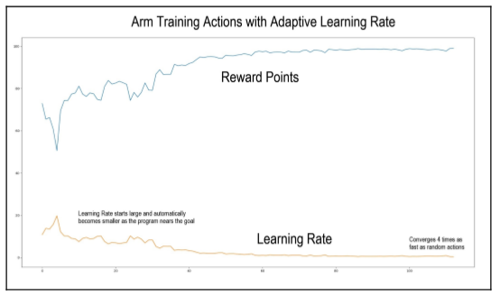

# 5.3 Обучение манипулятора/клешни робота

Теперь мы прыгнем в глубь и начинаем писать код.

Мы можем начать с разговора о том, как мы посылаем команды в манипулятор/клешню. Двигатели, которые я выбрал для робота TinMan, являются более мощными версиями стандартных "servo motors"- серводвигателей, с металлическими зубчатыми колесами. "Servo motors"- Серводвигатели управляются путем установки угла, под которым будет предполагаться выходной “shaft to assume”. Углы ведут в диапазоне от 0 до 180 градусов. Однако команды для позиций двигателя выполняются от 1 до 255, поэтому они помещаются в одно 8-битное значение. Мы будем преобразовывать эти байтовые команды двигателя в и из углов в программе.

## 5.3.1 Первая версия - состояние действия RL

В нашей первой версии программы обучения работе с манипулятором/клешней мы познакомим вас с базовой основой и используем самую примитивную форму машинного обучения, которая заключается в том, чтобы просто попробовать случайные движения, пока программа не найдет что-то, что работает.


Вы должны иметь в виду, что определенное положение манипулятора/клешни может иметь несколько действительных решений в нашей комбинации из трех двигателей.  Например, двигатель 1 может иметь чуть больший угол, а двигатель 3 чуть меньше, чтобы добраться до тех же самых декартовых координат.

```text
import numpy as np 
from math import *
import matplotlib.pyplot as mp
```

Мы начнем с настройки некоторых глобальных переменных и объектов, которые будем использовать.  Матрица действия - это набор всех действий, доступных в любом состоянии, и это комбинация трех двигателей с тремя действиями - вращением влево, без движения, или вращением вправо. Три двигателя с тремя действиями каждый дает нам 27 комбинаций. Почему мы включаем комбинацию $$[0,0,0]$$ , которая вообще не представляет движения?  Мы вычисляем вознаграждение за каждое действие, и если каждое другое действие, кроме $$[0,0,0]$$, приводит к более низкому результату, то мы максимизировали наше достижение цели:

```text
# action matrix - all possible combinations of actions of the three motors
ACTIONMAT = np.array
([[0,0,-1],[0,0,0],[0,0,1],
[0,-1,-1],[0,-1,0],[0,-1,1],
[0,1,-1],[0,1,0],[0,1,1],
[-1,0,-1],[-1,0,0],[-1,0,1],
[-1,-1,-1],[-1,-1,0],[-1,-1,1],
[-1,1,-1],[-1,1,0],[-1,1,1],
[1,0,-1],[1,0,0],[1,0,1],
[1,-1,-1],[1,-1,0],[1,-1,1],
[1,1,-1],[1,1,0],[1,1,1]])
```


Теперь мы создаем объект манипулятора/клешни робота, чтобы обеспечить стандартный интерфейс к функциям манипулятора/клешни и создать структуру данных для подвешивания информации о манипуляторе/клешне робота. Манипулятор/клешня имеет состояние, которое является текущим набором из трех положений двигателя.  Положение двигателя указано в радианах. Манипулятор/клешня имеет цель, которая является двухмерной $$(х  у)$$ координатой для перемещения положения захвата манипулятора/клешни:

```text
class RobotArm():
def __init__(self):
self.state = [0,0,0]
```

Метод $$setState$$ в классе $$RobotArm() $$ обновляет текущее состояние двигателей манипулятора/клешни. Он также пересчитывает координаты $$(х  у)$$ руки робота \(которые измеряются от кончика "gripper jaws"- челюстей захвата\):

```text
def setState(self,st):        
self.state = st       
 self.position = calHandPosition(st)
```

Метод $$setGoal$$ устанавливает новое желаемое положение для руки робота:

```text
def setGoal(self,newGoal):       
 self.goal = newGoal
```

Метод $$Calculate Reward$$ вычисляет награду, основываясь на текущем соотношении между рукой робота, заданной через $$self.posistion$$ , и желаемой точкой, сохраненной в $$self.goal$$ . Мы хотим, чтобы награда была пропорциональна расстоянию между целью и позицией. Мы присуждаем 100 очков за то, что мы находимся у цели, и 0 очков за то, что мы находимся как можно дальше от цели, что случается на расстоянии 340 мм. Мы подсчитываем это путем вычисления процента от завершенной цели.  Мы используем Cartesian distance. Просто помните - чем ближе к цели, тем больше награда:

Я сознательно использую более простое использование Python, которое позволяет избежать некоторых проблем с читабельности для того, чтобы донести до читателя ясность цели. Я знаю, что на Python есть несколько довольно крутых трюков для эффективного комбинирования векторов, таблиц, списков и массивов, и вы можете размещать свои предложения по улучшению на сайте GitHub.

```text
def calcReward(self):       
dx = self.goal[0] - self.position[0]        
dy = self.goal[1] - self.position[1]        
dist2goal = sqrt(dx*dx + dy*dy)        
self.dist2goal = dist2goal        
# we want the reward to be 100 if the goal is met       
 	# and proportional to the distance from goal otherwise       
 	# the arm is 340mm long, so that is as far away as we can get       
 #       
 self.reward = (340.0-dist2goal)/340.0 * 100.0       
 	return self.reward
```

Метод $$step$$ действительно является главным для данного примера программы. Мы будем вводить новое действие для рассмотрения, и скорость обучения, которая “говорит”, как далеко двигаться двигателю при каждом увеличении. Для этой первой программы мы установим скорость обучения в 1.0. Мы применяем действие к текущему состоянию манипулятора/клешни робота, чтобы получить новое состояние.


Наш следующий шаг - проверка диапазона применения нового действия, чтобы убедиться, что мы не вытесняем двигатель за пределы допустимых границ. Наши угловые значения составляют от 0 до 255 целочисленных единиц. Мы используем функции $$min,max$$ , чтобы ограничить наши двигатели этими значениями:

```text
def step(self,act,learningRate):        
newState = self.state + (act * learningRate)       
# range check        
for ii in range(3):           
newState[ii]=max(newState[ii],0)            
newState[ii]=min(newState[ii],255.0)       
self.setState(newState)        
reward = self.calcReward() 
return self.state,reward
# for a given action, return the new state 
# just a utility to display the joint ang
def joint2deg(jointPos):    
return jointPos * (180.0 / 255.0) 
def calHandPosition(stat):    
m1,m2,m3=stat    
# calculate hand position based on the position of the servo motors   
 # m1, m2, m3 = motor command from 0 to 255   
 # forward kinematics    # we first convert each to an angle    
d1 = 102.5  # length of first joint (sholder to elbow) in mm   
 d2 = 97.26  # length of second joint arm (elbow to wrist) in mm    
d3 = 141    # length of thrird joint arm (wrist to hand)    
right = pi/2.0 # right angle, 90 degrees or pi/2 radians    
m1Theta = pi - m1*(pi/255.0)    
m2Theta = pi - m2*(pi/255.0)    
m3Theta = pi - m3*(pi/255.0)   
 m2Theta = m1Theta-right+m2Theta    
m3Theta = m2Theta-right+m3Theta
# begin main program 
# starting state
# our arm has states from 0 to 255 which map to degrees from 0 to 180 
# here is our beginning state 
state = [127,127,127] 
oldState = state 
learningRate = 2.0 
robotArm = RobotArm() 
robotArm.setState(state) 
goal=[14,251] 
robotArm.setGoal(goal) 
knt = 0 # counter 
reward=0.0 # no reward yet... 
d2g=0.0 
oldd2g = d2g 
curve = [] 
# let's set the reward value for reaching the goal at 100 points
# 98% is good enough 
while reward < 98:    
index = np.random.randint(0,ACTIONMAT.shape[0])     
action = ACTIONMAT[index]     
state,reward = robotArm.step(action,learningRate)     
d2g = robotArm.dist2goal     
if d2g > oldd2g:
# if the new reward is worse than the old reward, throw this state 
away        
#print("old state",oldState,state,d2g,oldd2g)         
state=oldState
robotArm.setState(state) 
knt +=1 
oldd2g=d2g 
oldState=state 
curve.append(reward) 
if knt > 10000: reward = 101 
#print ("NewState ",state, "reward ",reward)
# see how long doing this randomly takes
print ("Count",knt,"NewState ",state, "reward ",max(curve)) 
mp.plot(curve) 
mp.show()
```

Результаты нашей первой программы обобщены на следующей выходной диаграмме, показывающей, что процесс машинного обучения может происходить даже в очень примитивной программе, такой как эта, которая просто пытается делать случайные вещи, пока не найдет что-нибудь, что работает:

![Number of iterations:  399, final state:  \[211.  57.  55.\], and final reward:  98.32.](.gitbook/assets/5.png)

### 5.3.1.1 Адаптивное обучение

В нашем первом примере мы использовали постоянную скорость обучения в три действия для перемещения манипулятора/клешни робота. Это равно примерно 2,1 градуса движения от двигателя. Этот шаг - наименьшее и наибольшее одношаговое движение, которое мы делали на каждом этапе процесса обучения. Что, если мы изменим скорость обучения адаптивно? Когда мы приближаемся к цели, мы можем сделать шаги поменьше, а если мы уйдем дальше, то сможем сделать и большие шаги. Мы вставляем строку при каждом обновлении сразу после того, как рассчитаем вознаграждение, как показано здесь:

```text
state,reward = robotArm.step(action,learningRate) 
# insert this new line to try an adaptive learning rate 
learningRate = (100-reward)/2.5
```

Максимальное вознаграждение за достижение цели - 100 очков. Мы хотим, чтобы скорость обучения была обратным соотношением к вознаграждению. По мере того, как награда становится больше, ставка обучения становится меньше. Я также добавил скорость обучения к записи данных и создал следующую диаграмму из результатов. Вы можете видеть, что тренировочное действие сходилось намного быстрее. После ряда испытаний она в среднем в четыре раза быстрее, чем случайный подход, который мы использовали в первом примере. Вы можете видеть, что скорость обучения приближается к нулю, так как награда приближается к 100:



* Number of Iterations: 98; 
* Final state \[ 51 199 198\] Reward: 99.15 
* Distance to Goal: 2.88 mm 
  Learning Rate: 
* Maximum: 14.17 Minimum: 0.34

## 5.3.2 Реализация Q-Learning

Теперь в этой следующей части компьютерного кода мы будем развивать наш обучающий код для манипулятора/клешни, чтобы включить в него то, что, как вы, возможно, заметили, отсутствовало в первой программе в предыдущем разделе. Он не планировал никакого пути; он просто обеспечил комбинацию из трех положений двигателя, в результате чего манипулятор/клешня оказалась в нужном положении. Он не пытался найти хороший путь от начальной точки до конечной. Наша следующая программа сделает именно это, и будет использовать технику Q-Learning, о которой мы говорили.


Я пропущу функции утилиты, которые мы разработали в первой программе и которые повторно используются во второй программе. Полный код будет доступен для скачивания с сайта GitHub. Это позволяет нам ограничиться новыми секциями в этом блоке кода. Несколько быстрых заметок: во многих программах Q-learning, весь набор возможных состояний доступен с самого начала. Манипулятор/клешня робота имеет большой объем, который он может исследовать, но мы будем использовать только небольшое подмножество его диапазона для выполнения наших задач. Я позволю программе выполнить итерацию по возможным состояниям двигателей, и добавлю новые состояния по мере их достижения в наш $$Qlist$$ .


В качестве краткого обзора, в Q-Learning, мы разрабатываем общую ценность комплекса действий, которые в совокупности приводят к тому, что робот достигает своей цели. Это общее значение действительного пути к цели называется $$Q$$ .


Мы добавляем фактор дисконтирования, который оштрафовывает более длинные пути; более короткий путь лучше. Этот коэффициент дисконтирования обычно называется греческой буквой $$Gamma$$ . Скидка - это число меньше 1 \(обычно 0.9 или около того\), и это один из настраиваемых параметров. Представь, что мы у цели: мы получаем полное вознаграждение, 100 баллов, а скидка - 0. Потом мы возвращаемся в состояние до того, как доберемся до цели, то есть в одном шаге.  Мы умножаем его на 0,9, таким образом он получает 9/10 вознаграждения \(90 очков\).  Следующее пространство, два шага назад, получает вознаграждение из 1-ступенчатого пространства \(90 очков\), умноженного на коэффициент дисконтирования \(Гамма\), который равен $$0,9 * 90$$ или $$81$$ .  Так что каждый шаг назад от ворот получает немного меньше награды. Путь с 10 шагами получает больше точек, чем путь с 20 шагами.


Другой важный момент в процессе Q-Learning заключается в том, что значение $$Q$$ устанавливается для этого состояния \(текущее положение манипулятора/клешни робота\) путем выбора следующего действия, в результате которого получается наивысшая награда. Вот так можно найти путь. Мы ищем действия, которые приближают нас к цели, и мы ценим эти действия в этом состоянии тем, насколько следующее действие улучшит нашу награду.  Другой способ объяснить эту концепцию: в каждом штате, или позиции, мы выясняем наш следующий шаг, который приведет нас к новой позиции, выбирая следующий шаг с наибольшим вознаграждением.  Для нашей программы мы вычисляем вознаграждение как обратно пропорциональное расстоянию до цели: чем ближе к цели, тем больше награда.


Вот основная программа для Q-learning.


Мы можем начать с установки начального или начального состояния. Наш манипулятор/клешня имеет состояния от 0 до 255, которые отображаются на карте в градусах от 0 до 180. Вот наше начальное состояние:

```text
BEGIN MAIN PROGRAM 
state = [127,127,127]

We initialize our "Q" matrix. Q is a matrix of the number of states by the 
number of actions. We will add states as we go in this version of this 
program, so Q starts out as an empty list:  
Q=[]
```

Мы используем начальный курс обучения для манипулятора/клешни. Мы начинаем с трех действий на каждое движение, что составляет примерно 2 градуса движения на двигатель:

```text
learningRate = 3.0
```

Мы инстанцируем наш объект $$RobotArm()$$ и инициализируем его:

```text
robotArm = RobotArm()
```

Мы устанавливаем состояние манипулятора/клешни робота в соответствие с нашей локальной переменной, которую мы устанавливаем на среднее значение $$[127 ,127, 127]$$ . Вы также можете установить начальное состояние робота в некоторую случайную точку, но вам нужно сделать некоторую проверку, чтобы убедиться, что у вас нет недействительного положения, которое попадает в тело робота. Я проверил, что эта средняя позиция приемлема:

```text
robotArm.setState(state)
```

Далее, мы поставили цель. Это положение захвата манипулятора/клешни, в котором  манипулятор/клешня готова поднять/захватить предмет:

```text
goal=[14,251] 
robotArm.setGoal(goal)
```

Мы инициализируем некоторые локальные переменные. Нам нужен счетчик для отслеживания наших итераций, а также для создания переменной вознаграждения и установки ее на ноль:

```text
knt = 0 
# counter reward=0.0
```

Гамма - это наша скидка, которую мы используем для того, чтобы оштрафовать более длинные пути. Так как при нашем маленьком размере шага это займет довольно много времени, нам нужно, чтобы это число было чуть меньше 1. Это уменьшит вознаграждение на пять процентов за каждый сделанный шаг:

```text
gamma = 0.95 # discount for rewards that take more time
```

Мы используем значение $$stateReset$$ для сброса состояния робота между прогонами, чтобы каждый раз мы начинали в одном и том же месте:

```text
stateReset = [127,127,127] 
state = stateReset
robotArm.setState(state)
```

$$G$$ - это наше общее значение пути от начала до конца. Это сумма наград за этот путь. Каждый шаг на пути получает индивидуальное вознаграждение, и $$G$$ - это сумма вознаграждения за все эти шаги:

```text
G=0
```

В этом разделе начинается обучение с использованием Q-learning. Мы установили несколько тренировочных эпизодов. Нам нужен компьютер, чтобы заполнить как можно больше пар действия пространства состояний, чтобы обеспечить полную матрицу для обучения. Каждая запись имеет состояние, выбранное действие и стоимость вознаграждения за это действие:

```text
for epoch in range(1,100):
```

Мы устанавливаем значение переменной $$done$$ равным False, когда тренировочное вознаграждение преодолевает некоторый порог:

```text
done=False
```

Теперь сбросьте значение пути, награду и счетчик за каждый пробег:

```text
G,reward,knt = 0,0,0 
state = stateReset 
robotArm.setState(state)
```

Это настоящая тренировочная петля. Мы работаем до тех пор, пока не найдем правильный путь или не превысим максимальное количество попыток. Путь с 1000 шагами не очень ценен, поэтому мы установили максимальную длину пути на 1000.

Функция образец действия в этой программе имеет два режима. В режиме $$Q $$ он ищет следующее действие с наибольшим возможным значением, определяемым функцией $$Q $$. Если значение $$Q $$ не было определено для этой пары состояние/действие, то мы добавляем случайный ход из нашей таблицы состояний и оцениваем это действие. Мы храним действия в матрице $$Q $$ в виде перечисления, которое можно посмотреть, используя матрицу $$ACTIONMAT$$ , созданную в предыдущей программе. У него есть 27 возможных действий, которые мы можем предпринять в каждом штате. Этот тип перечисления распространен в программах машинного обучения:

```text
while not done: 
action = action_sample("Q",state,Q) 
motorAction = ACTIONMAT[action]
```

Функция $$step $$ работает так же, как и раньше. Он вычисляет вознаграждение и новое состояние манипулятора/клешни робота с учетом действия, выбранного функцией $$action-sample$$ :

```text
state2,reward = robotArm.step(motorAction,learningRate)
```

Это функция Q- learning, которая определяет значение предыдущего действия на основе вознаграждения следующего состояния:

```text
newQ=reward + gamma * maxQ(Q, state2)
```

Мне пришлось создать функцию для вставки этого нового значения $$Q $$ в матрицу $$Q $$ в соответствующем месте. Матрица $$Q $$ индексируется по state и action. К концу обучения в каждом возможном состоянии будет 27 ценностей, по одной для каждого возможного действия, в том числе и бездействия вообще:

```text
setQ(Q,state,action,newQ)
```

$$G$$ - это накопленная стоимость этого пути, так что это всего лишь сумма всех наград:

```text
G += reward
```


Мы увеличиваем счетчик и проверяем, не слишком ли длинен наш путь. Если она не достигла решения на 1000 шагов, мы начинаем сначала. Помните, наша цель - заполнить матрицу $$Q $$, а не просто вычислить путь:

```text
knt +=1 
if knt > 1000 or reward > 90: 
done=True
```

Эти две строки кода обновляют состояние манипулятора/клешни робота в объекте манипулятора/клешни и теперь, когда мы завершили наши вычисления и выбрали действие и состояние для выполнения дальше по нашему пути:

```text
state = state2 
robotArm.setState(state)
```

Мы распечатываем небольшой отчет, чтобы оператор знал, как идут дела:

```text
if epoch % 2 == 0: 
print("Epoch ",epoch,"TotalReward:",G," counter:",knt,"Q Len ",len(Q))
```

Вывод нашей программы выглядит так:


Вы можете наблюдать за счетчиком, чтобы увидеть, что генерируемые пути, как правило, становятся короче, но имейте в виду, что этот процесс, в первую очередь, исследует пространство, до которого может дотянуться манипулятор/клешня робота, и устанавливает значения для действий двигателя по перемещению манипулятора/клешни.

## Версия 2 - индексированные состояния и действия

Я был не очень доволен производительностью первой версии этой программы, так что я оглянулся вокруг, чтобы сделать некоторые улучшения. На запуск программы ушло довольно много времени - более часа на первую итерацию. Было бы намного проще поместить состояния в какой-нибудь список, а затем ссылаться на них по индексу или индексу. Помните, что каждое состояние представлено тремя цифрами, показывающими позиции каждого из наших трех рукавных двигателей - M1, M2 и M3. Создадим индекс к этим состояниям и заменим его на единственное число, которое мы будем называть статистикой \(состояние минус "е"\). Тогда любая переменная, имеющая статус, а не состояние, использует индекс, а не полные три значения для состояния. Это значительно упрощает код и позволяет использовать гораздо более быстрые функции $$numpy$$ для работы со списками. Я также создал функцию $$getStateIndex$$ , которая выполняет двойную обязанность . Если состояние уже есть в таблице, мы возвращаем индексный номер \(pointer for you C fan\). Если его нет в таблице, мы добавляем его. Это упрощает логику. Мы используем глобальную переменную $$MAXSTATE$$ , чтобы отслеживать, сколько состояний мы имеем в таблице. Эти скромные изменения привели к 40-кратному увеличению скорости обучения. Я также добавил функцию маринования в конце, чтобы сохранить таблицу $$Q$$ , чтобы мы могли использовать ее снова для установки. Функция $$pickle$$ позволяет хранить содержимое переменной, в данном случае нашего нумерованного массива значений $$Q$$, на жестком диске, чтобы можно было получить его позже:

```text
STATEINDEX = [] 
def getStateIndex(state):    
global MAXSTATE    
thisState = state.tolist()    
if thisState in STATEINDEX:        
return STATEINDEX.index(thisState)   
 else:        
# not found in state index, we add it        
STATEINDEX.append(thisState)        
MAXSTATE +=1
```

Я добавил режим в функцию $$action-sample$$ , который я вызываю через $$maxreturn$$ . Вы помните, что мы начинали с того, что случайным образом выбирали действие и вычисляли награду, а затем сохраняли действие, если в результате действия манипулятор/клешня двигалась ближе к цели. Если у нас уже есть счет $$Q$$ , вычисленный для этого действия, мы его принимаем. Если у нас нет значения $$Q$$, мы вычисляем вознаграждение за все 27 возможных действий и принимаем то, что имеет наибольшее вознаграждение - а не значение \($$Q$$\). Эта функция выполняет максимальное вознаграждение за пару \(состояние, действие\) \(обычно аннотируется как максимальное $$R(s,a)$$ \). Это определенно ускоряет процесс перехода к решению:

```text
def action_sample(mode,stat,Qmatrix, learningRate, goal):    
state = STATEINDEX[stat]    
if mode=="random": 
index = np.random.randint(0,ACTIONMAT.shape[0])       
print("RAND ACTION",index)        
#action = ACTIONMAT[index]       
return index    
if mode=="maxreturn":        
state=STATEINDEX[stat]        
maxRew=-9990        
doAction=1 
for adex in range(len(ACTIONMAT)):            
act = ACTIONMAT[adex]            
thisReward = predictReward(state,goal,act,learningRate)           
if thisReward > maxRew:                
maxRew=thisReward                
doAction = adex            
if maxRew == -9990:                
doAction= action_sample("random",stat,Qmatrix,learningRate,goal)    
return doAction   
if mode=="Q": 
try:           
 # note this returns the number of the action with the highest Q score!           
 action = np.argmax(Q[statQ])           
 return(action)       
except:           
 # no action found            
action= action_sample("maxreturn",stat,Qmatrix,learningRate,goal)           
 return action
```

Начните основной цикл программы и создайте стартовое состояние. Наш манипулятор/клешня имеет состояния от 0 до 255, которые отображаются на карте в градусах от 0 до 180. Вот наше начальное состояние $$(127 ,127, 127 ,127)$$ , положение трех двигателей в середине их диапазона. Мы инициализируем нашу $$Q$$-матрицу, создавая нулевой массив. $$Q$$ - это матрица количества состояний, умноженная на количество действий. Мы будем добавлять состояния по мере того, как мы идем в этой версии программы, но мы не хотим много мусора в памяти, так что мы создадим большую таблицу для начала. Мы предварительно выделяем 15 000 пробелов, чтобы поместить состояния и действия в матрицу $$Q$$, и если нам нужно сделать ее больше, мы используем $$np.resize$$ , чтобы расширить ее:

```text
Q=np.zeros((150000,27)) 
state = np.array([127,127,127]) 
# initial learning rate for the arm - we start with 3 units 
learningRate = 10 
robotArm = RobotArm() 
robotArm.setState(state) 
goal=[14,251] 
robotArm.setGoal(goal)
# Q learning phase 
stateReset = np.array([127,127,127]) 
state = stateReset 
robotArm.setState(state) 
# discount function 
gamma = 0.6 
rewardData = [] 
# perform training on Q Learning 
for epoch in range(1,1000):
done=False    
G,reward,knt = 0,0,0    
state = randomState()   
#state = np.array([127,127,127])    
robotArm.setState(state)    
stat = getStateIndex(state)    
while not done:
action = action_sample("Q",stat,Q, learningRate,robotArm.goal)       
 motorAction = ACTIONMAT[action]        
state2,reward = robotArm.step(motorAction,learningRate)        
stat2 = getStateIndex(state2)       
Q[stat,action]=reward + gamma * np.max(Q[stat2])       
G += reward        
knt +=1        
if knt > 1000 or reward > 90: 
done=True        
stat = stat2        
robotArm.setState(STATEINDEX[stat])        
# see if we need more states...       
 if len(STATEINDEX)> len(Q)-10:
wid,hit = Q.shape           
 wid += 1000           
 print( "Adding 1,000 more Q values", wid)

Q.append(np.zeros((1000,hit)))    if epoch % 2 == 0:
print("Epoch ",epoch,"TotalReward:",int(G)," counter:",knt,"Q Len ",MAXSTATE)
# now that we are done, we save the Q array so we can reuse it 
output = open('q-arm-matrix.pkl', 'wb') 
# Pickle dictionary using protocol 0. pickle.dump(Q, output) 
output.close()
```

Мы завершаем нашу программу, распечатывая отчет для вас, чтобы вы могли увидеть, как идут дела. Мы также сохраняем массив $$Q$$, чтобы его можно было использовать в установке. Мы бы использовали Q-learning, ссылаясь на матрицу в другой программе и выбирая из матрицы пару состояний с наибольшим значением $$Q$$. Если бы наше пространство состояний было 234,14, то мы бы посмотрели в матрицу и увидели, что действие 13 имеет высшую награду. Затем мы проверим нашу таблицу действий и увидим, что действие 13 - это $$[-1, -1, -1]$$ , перемещая каждый двигатель на один шаг против часовой стрелки. Мы бы отправили эту команду роботу. Вот результат нашей программы Q-обучения. В данном конкретном случае, изучение $$Q$$ не очень эффективно. Общее вознаграждение должно повышаться, а это не так. Это связано с тем, что у нас огромное количество состояний, и в каждую эпоху мы отыгрываем лишь небольшое количество пар состояний. Нам нужно будет провести много эпох \(более 1000\), чтобы увидеть, как в этом случае начинает работать Q-learning:


## Генетические алгоритмы

Мы опробовали Q-learning в паре различных конфигураций с разным успехом в обучении нашего робота. Основная проблема с Q-learning заключается в том, что у нас очень большое количество возможных состояний или положений, в которых может находиться манипулятор/клешня робота. Это означает, что получить много знаний о любом положении путем повторных испытаний очень сложно. Мы собираемся внедрить другой подход, используя генетические алгоритмы для генерации наших движений.

Перемещение манипулятора/клешни робота требует координации трех двигателей одновременно для создания плавного движения. Нам нужен механизм для создания различных комбинаций движений двигателя, чтобы робот мог тестировать. Мы могли бы просто использовать случайные числа, но это неэффективно, и мы могли бы провести тысячи и тысячи испытаний, чтобы получить тот уровень подготовки, который мы хотим. Что, если бы у нас был способ попробовать различные комбинации движения, а затем конкурировать друг с другом, чтобы выбрать лучшую. Это было бы что-то вроде дарвиновского выживания наиболее подходящего для сценариев движения манипулятора/клешни.

Вот наш процесс. Выполняем пробный прогон для перехода из положения 1 \(neutral carry\) в положение 2 \(pickup\). Робот перемещает манипулятор/клешню 100 раз, прежде чем перевести в нужное положение. Мы оцениваем каждое движение, исходя из процента достижения цели, указывая, насколько это движение способствовало достижению цели. Мы берем 10 лучших ходов и помещаем их в базу данных. Мы снова запускаем тест и делаем то же самое - теперь у нас есть еще 10 лучших ходов и 20 ходов в базе данных. Мы берем пять лучших из первого сета и пересекаем их с пятью лучшими из второго сета - плюс пять ходов, выбранных случайным образом, и еще пять, состоящих из абсолютно случайных ходов. Мы выполняем эту последовательность ходов, а затем берем 10 лучших индивидуальных ходов и продолжаем. Мы должны быстро, через выделение, перейти к последовательности, которая выполняет задачу. Может быть, это и не оптимально, но сработает. Мы управляем нашим генофондом, чтобы создать решение проблемы путем последовательного приближения.

Мы хотим сохранить хорошее сочетание возможностей, которые можно комбинировать различными способами, чтобы решить проблему перемещения манипулятора/клешни к своей цели:


На самом деле мы можем использовать несколько методов скрещивания \(cross breeding\) наших последовательностей движений. То, что я описал, является простым крестом - половина мужского генетического материала и половина женского \(простите за биологическую метафору\). Мы могли бы взять это по четвертям - $$¼$$ мужчин, $$¼$$ женщин, $$¼$$ мужчин, $$¼$$ женщин, $$¼$$ женщин, чтобы иметь два креста. Мы также можем случайно взять кусочки у того или иного. Пока мы будем придерживаться стратегии "половина/половину", но вы вольны экспериментировать.

Вы собираетесь выступить с возражением: что если движение займет менее 10 шагов? Легко - когда мы добираемся до цели, мы останавливаемся и отбрасываем оставшиеся шаги.

Мы ищем не идеальное или оптимальное выполнение задачи, а что-то достаточно хорошее, чтобы ее выполнить. Для многих робототехники реального времени, у нас нет роскоши времени, чтобы создать идеальное решение, так что любое решение, которое делает работу адекватной.

Почему мы добавили пять дополнительных случайных движений выборки и пять абсолютно случайных движений?  Это также имитирует естественный отбор - силу мутации.  Наши генетические коды не совершенны, и иногда передается более низкий материал.  Мы также испытываем случайные мутации от плохих копий генов, космических лучей или вирусных заболеваний. Мы вводим некоторые случайные факторы для "ухаживания"- "bump" за настройкой или алгоритмом - естественным отбором - в случае, если мы сходимся на локальном минимуме или пропускаем какой-нибудь простой путь, так как он еще не произошел с нашими предыдущими движениями.

Зачем нам все эти неприятности? В общем алгоритм может сделать что-то очень сложное для части программного обеспечения - он может вводить новшества или развивать новый процесс из примитивных действий, в основном, пробовать что-то, пока не найдет то, что работает, а что - нет. Мы предусмотрели еще один процесс машинного обучения, чтобы добавить в наш инструментарий, но такой, который может создавать решения, которые мы, программисты, не задумывали заранее.

Давайте погрузимся в процесс генетического алгоритма.

В этой версии мы будем строить свои собственные инструменты, но есть несколько готовых наборов инструментов, которые помогут вам создать генетические алгоритмы, такие как DEAP \(Distributed Evolutionary Algorithms in Python\), который можно найти на сайте [https://github.com/DEAP](https://github.com/DEAP) и установить, набрав "pip install deap".

В интересах прозрачности, мы собираемся построить собственный генетический алгоритм процесса с нуля. Вы слышали о выживании сильнейших? Таким образом, мы решаем, какие планы наиболее подходят, и получаем возможность выживать и размножаться. Я даю тебе песочницу, чтобы ты играл в генного инженера, где у тебя есть доступ ко всем частям, и за занавеской ничего не спрятано. Вы увидите, что для нашей проблемы код не так уж и сложен.

Мы начнем с создания функции $$computefitness$$ , той, которая оценивает наш генетический материал. Фитнес - это наш критерий для градации нашего алгоритма. Мы можем изменить его в соответствии с содержанием нашего сердца, чтобы адаптировать нашу продукцию к нашим потребностям. В этом случае мы делаем путь в пространстве для манипулятора/клешни робота от начальной точки до конечной точки цели. Мы судим о нашем пути по тому, насколько близка любая точка пути к нашей цели. Как и в наших предыдущих программах, мы составляем движение робота в виде 27 комбинаций из трех двигателей, идущих по часовой стрелке, против часовой стрелки или не движущихся. Мы делим движение на маленькие шажки, каждые три мотора \(1,8 градуса\) так движения. Мы связываем вместе целую группу этих шагов, чтобы создать путь. Фитнес-функция проходит по дорожке и рассчитывает положение рук на каждом шаге.

Функция $$preictReward$$ производит пробное вычисление того, куда двинулся манипулятор/клешня робота в результате этого шага. Допустим, мы переместим двигатель 1 по часовой стрелке на три шага, оставим двигатель 2 в покое и переместим двигатель 3 против часовой стрелки на три шага. Это заставляет манипулятор/клешню слегка двигаться вверх и вниз. Каждый шаг мы забиваем индивидуально по тому, насколько близко к цели. Наш счет вычисляется из 100; 100 точно у ворот, и мы забираем по одному очку за каждые 1/100 расстояния от ворот, максимум до 340 мм. Почему 340? Это общая длина манипулятора/клешни. Мы оцениваем общее движение немного по-другому, чем ты думаешь. Получение наград не имеет никакого значения, так как мы хотим, чтобы точка наиболее близко подошла к цели. Поэтому мы выбираем единственный шаг с наивысшей наградой и сохраняем эту ценность. После этого мы выбрасываем любые шаги, так как они нас только заберут. Таким образом, мы автоматически подрезаем наши пути к цели.

Я использовал термин $$allel$$ , чтобы обозначить один шаг из общего пути, который я назвал $$chrom$$ , сокращенно от хромосомы:

```text
def computeFitness(population, goal, learningRate, initialPos): 
fitness = []
gamma = 0.6 
state=initialPos 
index = 0 
for chrom in population: 
value=0 for allele in chrom: 
action = ACTIONMAT[allele] 
indivFit, state = predictReward(state,goal,action,learningRate) 
value += indivFit 
if indivFit > 95: 
# we are at the goal - snip the DNA here 
Break
fitness.append([value,index]) 
index += 1 
return fitness
```

Как нам начать свой путь? Функция $$make-new-individual$$ строит нашу начальную популяцию хромосом, или путей, из случайных чисел. Каждый из них содержит путь, состоящий из числа от 0 до 26, которое представляет все действительные комбинации команд двигателя. Мы установили длину пути случайным числом от 10 до 60:

```text
def make_new_individual(): 
# individual length of steps 
lenInd = random.randint(10,60) 
chrom = [] # chromosome description 
for ii in range(lenInd):
chrom.append(randint(26)) 
return chrom
```

Мы используем функцию roulette, чтобы выбрать часть нашего населения, чтобы продолжить. Каждое поколение мы выбираем из 50 % лучших, чтобы пожертвовать свою ДНК для создания следующего поколения. Мы хотим, чтобы ценность пути, или хромосомы, взвесить процесс отбора; чем выше балл за награду, тем больше шансов завести детей. Это часть нашего процесса отбора:

```text
# select an individual in purportion to its value 
# i.e. the higher the value, the better the odds of getting picked 
def roulette(items): 
total_weight = sum(item[0] for item in items) 
weight_to_target = random.uniform(0, total_weight)
for item in items: 
weight_to_target -= item[0] 
if weight_to_target <= 0: 
return item 
# main Program 
INITIAL_POS = [127,127,127] 
GOAL=[-107.39209423, -35.18324771] 
robotArm=RobotArm() 
robotArm.setGoal(GOAL) 
population = 300
learningRate = 3 
crossover_chance = .50 
mutate_chance = .001 
pop = []
```

Начнем с того, что построим наше первоначальное население из случайных частей. Их первоначальная пригодность будет очень низкой: около 13% или меньше. Мы будем поддерживать бассейн из 300 индивидуальных дорожек, которые мы называем хромосомами:

```text
for i in range(population): 
pop.append(make_new_individual())
 trainingData=[]
epochs = 100
```

Здесь мы настраиваем петлю, чтобы пройти через 100 поколений нашего естественного отбора. Мы начинаем с вычисления фитнеса каждого человека и добавляем эту оценку в список фитнеса с индексом, указывающим на хромосому:

```text
for jj in range(epochs): 
# evaluate the population 
fitnessList = computeFitness(pop,GOAL,learningRate, INITIAL_POS)
```

Мы сортируем фитнес, чтобы получить лучших людей. Мы сортируем в обратном порядке.  Самое большое число должно быть первым:

```text
fitnessList.sort(reverse=True
```

Мы удерживаем верхние 50% населения и отбрасываем нижние 50%.  Нижняя половина выпадает из генофонда как непригодная: 

```text
fitLen = 150 
fitnessList = fitnessList[0:fitLen] 
# survival of the fittest...
```

Мы вытаскиваем лучшего исполнителя из всего списка и помещаем его "hall of fame" \(or HOF\). В конце концов, это будет результатом нашего процесса. В то же время, мы используем значение HOF \(или HOFF\) как меру фитнеса этого поколения:

```text
hoff = pop[fitnessList[0][1]] 
print("HOF = ",fitnessList[0])
```

Мы сохраняем значение HOFF в списке  $$trainingData$$ , чтобы по окончании программы можно было составить график результатов:

```text
trainingData.append(fitnessList[0][0]) 
newPop = [] 
for ddex in fitnessList: 
newPop.append(pop[ddex[1]]) 
print ("Survivors: ",len(newPop))
```

На этом этапе мы удалили нижние 50% населения, удалив худших исполнителей. Теперь нам нужно заменить их детьми лучших исполнителей этого поколения. Мы будем использовать кроссовер в качестве техники спаривания. Существует несколько видов генетического спаривания, которые могут привести к успешному потомству. Кроссовер популярен и является хорошим местом для начала, а также легко кодируется. Все, что мы делаем, это выбираем место в геноме, и забираем первую половину у одного родителя, а вторую половину - у другого. Мы выбираем родителей для "приятеля"- "mate" случайным образом из оставшейся популяции, взвешенной пропорционально их пригодности. Это называется "выбор колеса рулетки"- "roulette wheel selection". Лучшие особи имеют более высокий вес и с большей вероятностью будут отобраны для размножения. Мы создаем 140 новых личностей, как дети этого поколения:

```text
# crossover 
# pick to individuals at random 
# on the basis of fitness 
numCross = population-len(newPop)-10 
print ("New Pop Crossovers",numCross) 
# # 
# add 5 new random individuals 
for kk in range(10): 
newPop.append(make_new_individual()) 
for kk in range(int(numCross)): 
p1 = roulette(fitnessList)[1] 
p2 = roulette(fitnessList)[1] 
chrom1 = pop[p1] 
chrom2 = pop[p2] 
lenChrom = min(len(chrom1),len(chrom2)) 
xover = randint(lenChrom) 
# xover is the point where the chromosomes cross over 
newChrom = chrom1[0:xover]+chrom2[xover:]
```

Наш следующий шаг - мутация. При реальном естественном отборе существует небольшая вероятность того, что ДНК\(DNA\) будет повреждена, изменена космическими лучами, неправильно скопирована последовательность или другими факторами. Некоторые мутации полезны, а некоторые нет. Мы создаем нашу версию этого процесса, имея небольшой шанс \(1/100 или около того\), что один ген в нашем новом детском пути случайным образом изменится на какую-то другую ценность:

```text
# now we do mutation 
bitDex = 0 
for kk in range(len(newChrom)-1): 
mutDraw = random.random() 
if mutDraw < mutate_chance: 
# a mutation has occured! 
bit = randint(26) 
newChrom[kk]=bit 
#print ("mutation") 
newPop.append(newChrom)
```

Теперь, когда мы сделали всю нашу обработку, мы добавляем этот новый детский путь к нашей популяции, и готовимся к тому, что следующее поколение будет оценено. Мы записываем некоторые данные и возвращаемся к началу:

```text
# welcome the new baby from parent 1 (p1) and parent 2 (p2) 
print("Generation: ",jj,"New population = ",len(newPop)) 
pop=newPop 
mp.plot(trainingData) 
mp.show() 
```

Итак, как мы справились с нашим безумным генетическим экспериментом? Следующий график вывода говорит сам за себя:


Генетический алгоритм, по всей видимости, немного вуду-программирования, работает вполне неплохо, как и механизм обучения для данного конкретного случая обучения манипулятора нашего робота. Наше решение достигло пика в 99,76% от цели \(около 2 мм\) всего через 90 поколений или около того, что довольно быстро для процесса обучения ИИ. Вы можете увидеть гладкий характер обучения, который показывает, что этот подход может быть использован для решения проблем при планировании путей движения руки нашего робота. Должен признать, что я довольно скептически относился к этому процессу, но, похоже, он неплохо работает для этой конкретной проблемной области.

Программирование действительно не было слишком сложным, и вы можете потратить некоторое время на улучшение процесса, откорректировав параметры генетического алгоритма. Что, если бы у нас было меньше населения? Что, если мы изменим критерии фитнеса? Залезай туда и посмотри, чему ты сможешь научиться.

