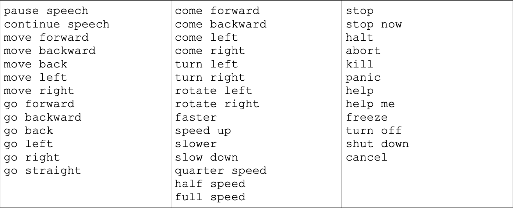

# 9. РАСПОЗНАВАНИЕ И СИНТЕЗ РЕЧИ

За последние несколько лет распознавание речи и Linux прошли долгий путь, главным образом благодаря проектам [CMU Sphinx](http://cmusphinx.sourceforge.net/) и [Festival](http://festvox.org/). Мы также можем воспользоваться существующими пакетами ROS для распознавания речи и преобразования текста в речь. Следовательно, довольно просто добавить речевой контроль и голосовую обратную связь к вашему роботу, как мы сейчас покажем.

В этой главе мы будем:

* Установите тестовый [pocketsphinx](http://wiki.ros.org/pocketsphinx) пакет для распознавания речи 
* Узнайте, как создать свой собственный словарный запас для распознавания речи  
* Телеоператорская зона имитации робота с использованием голосовых команд 
*  Установите тестовый набор текста в речь и пакет ROS [sound\_play](http://wiki.ros.org/pocketsphinx)

\_\_

#### _9.3 Создание словарного запаса_

Создать новый словарь или корпус легко, как указано в PocketSphinx. Сначала создайте простой текстовый файл с одним словом или фразой в строке. Вот корпус, который можно использовать для управления роботом с помощью голосовых команд. Мы будем хранить его в файле с именем nav\_commands.txt в подкаталоге config пакета rbx1\_speech. Чтобы просмотреть его содержимое, выполните команды:

```text
$ roscd rbx1_speech/config 
$ more nav_commands.txt
```

Вы должны увидеть следующий список фраз \(они будут отображаться в одном столбце на вашем экране\):



Вы также можете перенести файл в ваш любимый редактор и добавить, удалить или изменить некоторые из этих слов или фраз, прежде чем переходить к следующему шагу. Когда вы вводите свои фразы, старайтесь не смешивать прописные и строчные буквы и не используйте знаки препинания. Кроме того, если хотите включить число, например 54, обозначьте его как «пятьдесят четыре».

Прежде чем мы сможем использовать этот корпус с PocketSphinx, нам нужно скомпилировать его в специальный словарь и файлы произношения. Это можно сделать с помощью онлайн-модели языковой модели CMU \(**lm**\), расположенной по адресу:

[http://www.speech.cs.cmu.edu/tools/lmtool-new.html](http://www.speech.cs.cmu.edu/tools/lmtool-new.html)

Следуйте инструкциям по загрузке файла nav\_commands.txt, нажмите кнопку **«Compile Knowledge Base»**, затем загрузите файл с пометкой **«COMPRESSED TARBALL»**, содержащий все файлы языковой модели. Извлеките эти файлы в подкаталог config из пакета rbx1\_speech. Все файлы будут начинаться с одного и того же номера, например 3026.dic, 3026.lm и т. Д. Эти файлы определяют ваш словарный запас как языковую модель, понятную PocketSphinx. Вы можете переименовать все эти файлы во что-нибудь более запоминающееся, используя команду, подобную следующей \(4-значный номер, вероятно, будет другим в вашем случае\):

```text
$ roscd rbx1_speech/config
$ rename -f 's/3026/nav_commands/' *
```

Далее, посмотрите на файл voice\_nav\_commands.launch, находящийся в подкаталоге rbx1\_speech / launch. Это выглядит так:

> &lt;launch&gt;  
>  &lt;node name="recognizer" pkg="pocketsphinx" type="recognizer.py"
>
> output="screen"&gt;  
>  &lt;param name="lm" value="$\(find rbx1\_speech\)/config/nav\_commands.lm"/&gt;

> &lt;param name="dict" value="$\(find rbx1\_speech\)/config/nav\_commands.dic"/&gt; &lt;/node&gt;
>
> &lt;/launch&gt;

Как вы можете видеть, файл запуска запускает узелognizer.py из пакета pocketsphinx, и мы указываем параметры lm и dict на файлы nav\_commands.lmandnav\_commands.diccreatedinthestepsabove. Также обратите внимание, что параметр output = "screen" - это то, что позволяет нам видеть результаты распознавания в реальном времени в окне запуска.

Запустите этот файл и проверьте распознавание речи, контролируя тему /ognizer / output. Сначала нажмите Ctrl-C, чтобы завершить предыдущую демонстрацию RoboCup, если она все еще работает. Затем запустите команды:

```text
$ roslaunch rbx1_speech voice_nav_commands.launch
```

И в другом терминале:

```text
$ rostopic echo /recognizer/output
```

Попробуйте произнести несколько навигационных фраз, таких как «двигаться вперед», «замедлить» и «остановить». Вы должны увидеть, что ваши команды отражены в теме /ognizer / output.


